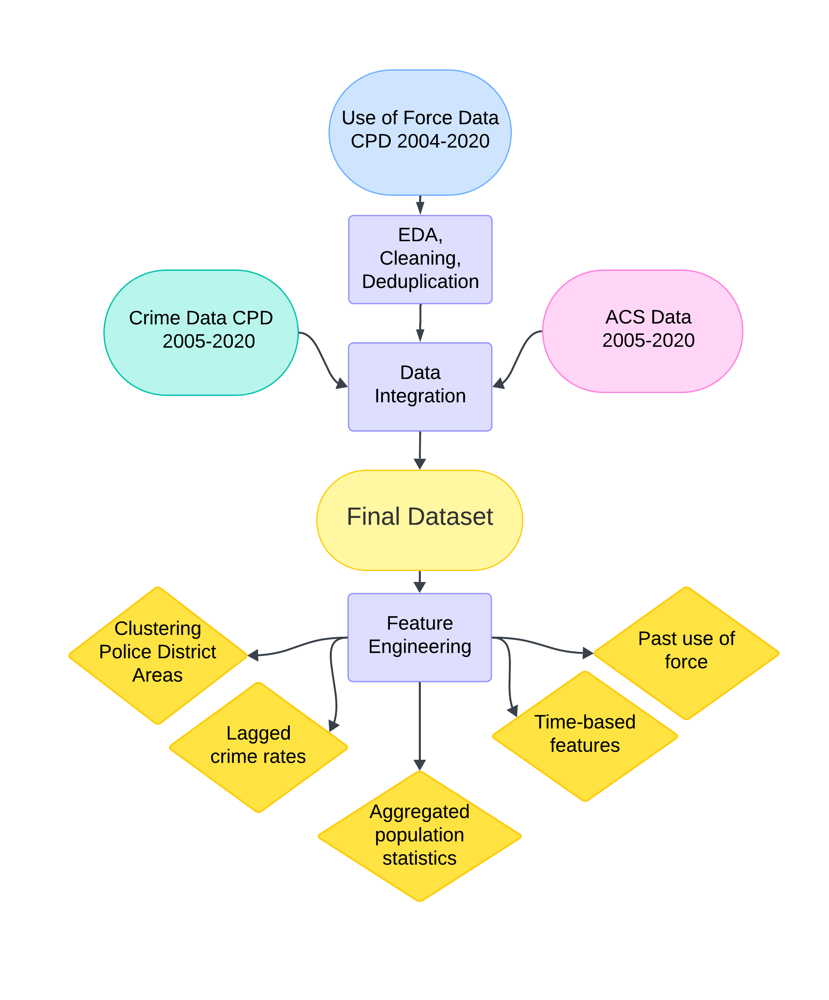
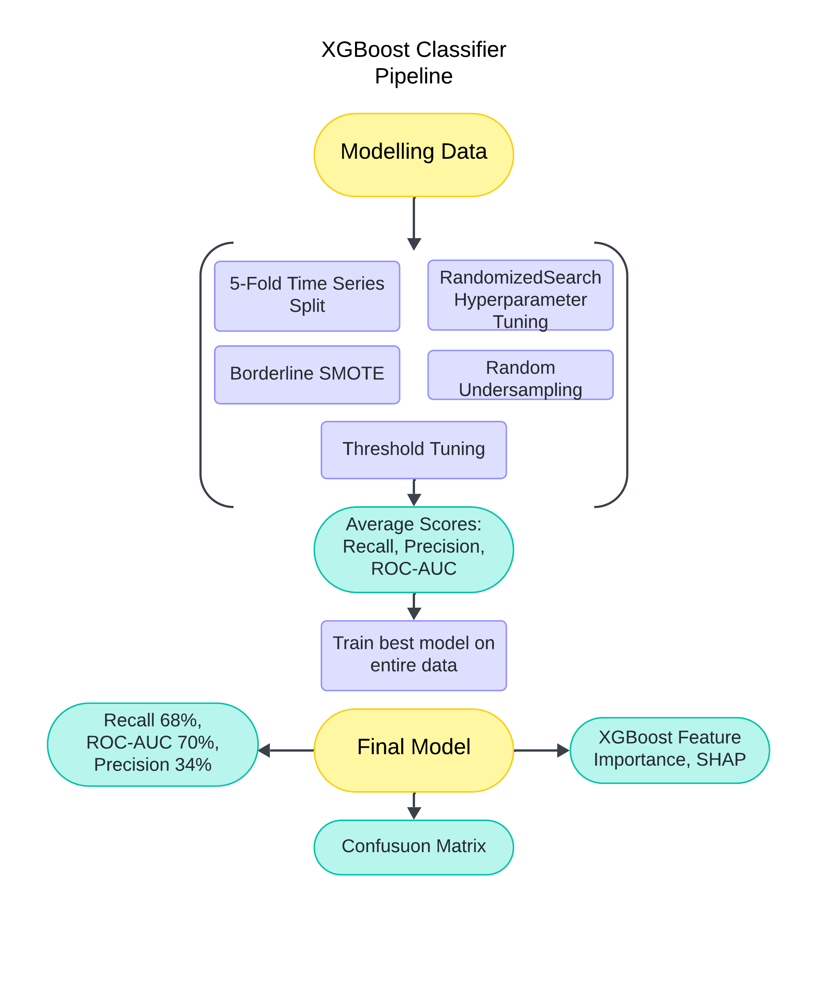

# SAN7-ERP
Code Repository for the ERP SAN7: Investigasting Police Behaviour: Predicting Civilian Injury in Police Use of Force Incidents in Chicago
The research proejct focused on integrating use of force data from the Chicago Police Department between 2004-2020 with socioeconomic variables (population, poverty, ethnic population estimates) from the ACS survey 2005-2020 and lagged crime rates from CPD public data. 
These features were included in an XGBoost Classifier preidicting civilian injury (true/false). 
## Data Sources:
City of Chicago Spatial Files
  2000-2010 Census Tracts	https://data.cityofchicago.org/Facilities-Geographic-Boundaries/Boundaries-Census-Tracts-2000/pt6c-hxpp (.shp)
	
  2010	Census Tracts	https://data.cityofchicago.org/Facilities-Geographic-Boundaries/Boundaries-Census-Tracts-2010/5jrd-6zik (.shp)
	
  19.02.2012-current	Police Districts	https://data.cityofchicago.org/Public-Safety/Boundaries-Police-Beats-effective-12-19-2012-/dq28-4w9c (.shp)

  CPD Use of Force Data between 2004 and 2020. Obtained through FOIA, but not yet published for open-source use. Data cannot be shared here and no identifiers are shown in the code. For more information, contact George Wood georgewood@stanford.edu or check https://github.com/george-wood/cpad for updates.
	
  Chicago Police Department (2024). Crimes - 2001 to Present. [dataset] Updated September 14, 2024. Available at: https://data.cityofchicago.org/Public-Safety/Crimes-2001-to-Present/ijzp-q8t2 [Accessed 14 September 2024].
	ACS 2010-2020 - Access available through API More information at: https://www.census.gov/data/developers/data-sets.html

  ACS Data 2005-2009. Steven Manson, Jonathan Schroeder, David Van Riper, Katherine Knowles, Tracy Kugler, Finn Roberts, and Steven Ruggles. IPUMS National Historical Geographic Information System: Version 18.0 [dataset]. Minneapolis, MN: IPUMS. 2023. http://doi.org/10.18128/D050.V18.0
  Tract Estimates of: 
	
1. Total Population
   Universe:    Total population
   Source code: B01003
   NHGIS code:  RK9

2. Hispanic or Latino Origin by Race
   Universe:    Total population
   Source code: B03002
   NHGIS code:  RLI

3. Ratio of Income to Poverty Level in the Past 12 Months
   Universe:   Population for whom poverty status is determined
   Source code: C17002
   NHGIS code:  RNB
   
## Data Integration Process Chart

## Modelling and Evaluation Process Chart

## Reproducibility and Notes
If rerunning the code, ensure all package versions are aligned with the ones shown in this repository. 

Multiple steps are taken to aggregate data from 4 different sources, so please make sure you follow the steps outlined in the code. 

Each notebook begins with a summary of the steps and codebooks are named and marked with a 'step-x' part of the title, indicating the order of the notebooks.

Due to memory efficiency issues with JupyterLab, the crime dataset had to be filtered and cleaned in R (STEP-1-CRIME-DATA-FILTERING). However, all subsequent analysis is in Python.

The code was executed on a Windows 11 device.

Required R Packages

To reproduce this project, you will need the following R packages installed:

    tidyverse (for data manipulation and visualization)
    dplyr (for data wrangling)
    readr (for reading rectangular data)
    arrow (for working with columnar data formats, including Apache Arrow)
    lubridate (for working with date-time data)

Required Python Packages

To reproduce this project, you will need the following Python packages installed:

    pandas (for data manipulation)
    geopandas (for working with geospatial data)
    numpy (for numerical operations)
    census (for accessing census data)
    us (for working with U.S. state and territory metadata)
    pkg_resources (for resource management)
    matplotlib (for plotting)
    seaborn (for advanced data visualization)
    scikit-learn (for machine learning)
    imbalanced-learn (for handling imbalanced datasets)
    xgboost (for gradient boosting)
    shap (for explainability in machine learning)
    joblib (for saving/loading models)
